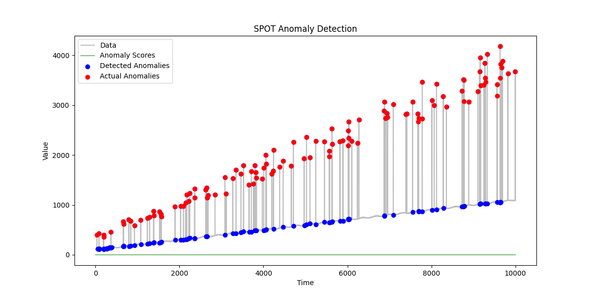

# Anomaly Detection Project

This project implements real-time anomaly detection using the SPOT (Streaming Peaks-Over-Threshold) algorithm. It was developed as part of the Cobblestone hiring project for the Graduate Software Engineer 2024 position.

## Objective

The main objective of this project is to implement a real-time anomaly detection system that can process a continuous stream of data, identify anomalies, and evaluate the performance of the detection algorithm. The system uses the SPOT algorithm from the StreamAD library and incorporates data smoothing techniques to improve detection accuracy.

## Installation

To set up this project, follow these steps:

1. Clone the repository:
   ```
   git clone https://github.com/aqueelahmedv/cobblestone-anomaly-detection.git
   cd cobblestone-anomaly-detection
   ```

2. Create a virtual environment (optional but recommended):
   ```
   python -m venv venv
   source venv/bin/activate  # On Windows, use `venv\Scripts\activate`
   ```

3. Install the required packages:
   ```
   pip install -r requirements.txt
   ```

## Running the Project

To run the anomaly detection system:

1. Ensure you're in the project directory and your virtual environment is activated (if you're using one).

2. Run the main script:
   ```
   python anomaly_detection.py
   ```

This will execute the anomaly detection algorithm on a generated data stream, evaluate its performance, and display the results both in the console and as a plot.

## Project Structure

- `anomaly_detection.py`: Main script containing the anomaly detection logic.
- `generate_stream.py`: Module for generating the data stream.
- `requirements.txt`: List of Python package dependencies.
- `README.md`: This file, containing project information and instructions.

## Note

This project uses a window size of 5 and a false alarm probability (q) of 1e-4 for the SPOT detector, which has been observed to give the best F1 score in tests.

## Results

The anomaly detection system's performance can be visualized in the following image:



This graph shows the original data stream, the smoothed data, and the detected anomalies. The red points indicate the anomalies identified by the SPOT algorithm, while the blue line represents the smoothed data used for detection.

Key performance metrics:
- Precision: 0.5025
- Recall: 0.9519
- F1 Score: 0.6578

These results demonstrate the effectiveness of this implementation in detecting anomalies in real-time data streams.
